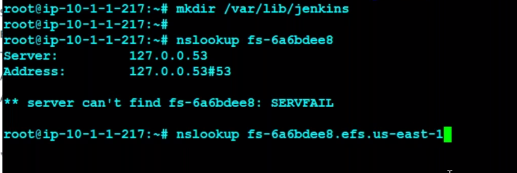

## CICD
* Continuous integration is a process where we integrate a set of tools or integrate a set of processes that we follow before to delivery or deploying the application to the customer.
* Continuous delivery is the process where we deploy the application on a specific platform of the customer.

## SSL(secure socket layers) Certificate
Ref::: https://www.mageplaza.com/blog/ssl-certificate.html?gclid=CjwKCAjwrranBhAEEiwAzbhNtV38zop0UM2s0PDEqZQIFrsliCB7M45waGAJddBAzY-xTsNBNvmIxRoCLBUQAvD_BwE
## In technology terms, an SSL certificate is a protocol for servers and web browsers, ensuring that data passed between the two are private. It’s done using an encrypted link that connects the server and browser.

## JENKINS ***
*To make Jenkins highly available use NFS in aws 

## Search for---> aws mount efs on fqdn---> to mount the jenkins on efs
** file-system-id.efs.aws-region.amazonaws.com
* nslookup
* 
* nano etc/fstab---> if we add in fstab then only it saves permanently mounted after restart
* ## for IP address based sudo mount -t nfs -o nfsvers=4.1,rsize=1048576,wsize=1048576,hard,timeo=600,retrans=2,noresvport mount-target-IP:/   /efs 
* ### find . -name jenkins.log---> To check what is happening in background while jenkins runnig
* ## cat /var/logs/jenkins/jenkins.log  ---> to check the logs
* docker ps -a ----> To check the background process of docker
* 
* ## Blue Ocean to check the multi branch pieline
* 